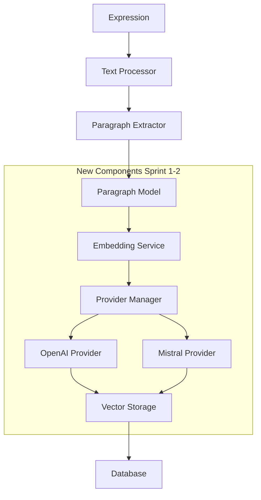

#### Sprint 1-2: Fondations du Système d'Embeddings (Semaines 1-2)

**Objectifs Sprint 1-2**:

- Créer l'architecture modulaire pour les embeddings
- Implémenter les providers OpenAI et Mistral
- Développer le système de gestion des paragraphes
- Établir les fondations pour l'analyse sémantique

### Architecture Cible Sprint 1-2



### Livrables Détaillés

```text
✅ Sprint 1-2 Deliverables:
├── Database Layer
│   ├── app/models/paragraph.py - Modèle Paragraph avec relations
│   ├── alembic/versions/001_add_paragraphs.py - Migration complète
│   └── alembic/versions/002_add_embedding_indexes.py - Index optimisation
├── API Layer  
│   ├── app/schemas/paragraph.py - Schémas Pydantic complets
│   ├── app/schemas/embedding.py - Schémas embedding requests/responses
│   └── app/api/v1/endpoints/paragraphs.py - Endpoints CRUD
├── Business Logic
│   ├── app/crud/crud_paragraph.py - CRUD operations optimisées
│   ├── app/services/embedding_service.py - Service principal
│   ├── app/services/text_processor.py - Extraction paragraphes
│   └── app/core/text_utils.py - Utilitaires NLP
├── Provider Architecture
│   ├── app/core/embedding_providers/__init__.py - Registry providers
│   ├── app/core/embedding_providers/base.py - Interface abstraite
│   ├── app/core/embedding_providers/openai_provider.py - OpenAI implémentation
│   ├── app/core/embedding_providers/mistral_provider.py - Mistral implémentation
│   └── app/core/embedding_providers/exceptions.py - Gestion erreurs
├── Configuration
│   ├── app/config.py - Configuration embeddings étendée
│   └── app/core/settings.py - Settings validation
├── Background Tasks
│   ├── app/tasks/embedding_tasks.py - Tâches Celery
│   └── app/tasks/text_processing_tasks.py - Extraction async
└── Tests
    ├── tests/unit/test_paragraph_model.py - Tests modèles
    ├── tests/unit/test_embedding_service.py - Tests service
    ├── tests/unit/test_providers.py - Tests providers
    ├── tests/integration/test_paragraph_workflow.py - Tests intégration
    └── tests/fixtures/embedding_fixtures.py - Fixtures de test
```

## Plan de Travail Détaillé par Jour

### **Semaine 1 - Sprint 1: Infrastructure de Base**

#### **Jour 1 (Lundi): Setup et Modèles de Données**

**Objectifs Jour 1**:
- Créer le modèle Paragraph avec toutes les relations
- Générer la migration de base de données
- Configurer les relations avec Expression

**Tâches Prioritaires**:

1. **8h00-10h00: Modèle Paragraph Complet**

```python
# app/models/paragraph.py
from sqlalchemy import Column, Integer, String, Text, DateTime, Float, ForeignKey, Index
from sqlalchemy.orm import relationship
from sqlalchemy.dialects.postgresql import ARRAY
from app.db.base_class import Base
from datetime import datetime

class Paragraph(Base):
    """Modèle pour les paragraphes extraits des expressions."""
    __tablename__ = "paragraphs"
    
    # Primary key et relations
    id = Column(Integer, primary_key=True, index=True)
    expression_id = Column(
        Integer, 
        ForeignKey("expressions.id", ondelete="CASCADE"), 
        nullable=False,
        index=True
    )
    
    # Contenu textuel
    text = Column(Text, nullable=False)
    text_hash = Column(String(64), nullable=False, index=True)  # SHA256 pour déduplication
    
    # Métadonnées structurelles
    position = Column(Integer, nullable=False, default=0)
    word_count = Column(Integer)
    char_count = Column(Integer)
    sentence_count = Column(Integer)
    
    # Analyse linguistique
    language = Column(String(10))  # ISO 639-1 code
    reading_level = Column(Float)  # Flesch reading score
    
    # Embeddings
    embedding = Column(ARRAY(Float))  # Ou VECTOR(1536) avec pgvector
    embedding_provider = Column(String(50))
    embedding_model = Column(String(100))
    embedding_dimensions = Column(Integer)
    embedding_computed_at = Column(DateTime)
    
    # Métadonnées temporelles
    created_at = Column(DateTime, default=datetime.utcnow, nullable=False)
    updated_at = Column(DateTime, default=datetime.utcnow, onupdate=datetime.utcnow)
    
    # Relations
    expression = relationship("Expression", back_populates="paragraphs")
    similarities_as_source = relationship(
        "Similarity", 
        foreign_keys="Similarity.paragraph1_id",
        back_populates="paragraph1"
    )
    similarities_as_target = relationship(
        "Similarity", 
        foreign_keys="Similarity.paragraph2_id", 
        back_populates="paragraph2"
    )
    
    # Contraintes et index
    __table_args__ = (
        Index('idx_paragraphs_expression_position', 'expression_id', 'position'),
        Index('idx_paragraphs_text_hash', 'text_hash'),
        Index('idx_paragraphs_embedding_provider', 'embedding_provider'),
        Index('idx_paragraphs_word_count', 'word_count'),
        {'extend_existing': True}
    )
    
    def __repr__(self):
        return f"<Paragraph(id={self.id}, expression_id={self.expression_id}, words={self.word_count})>"
    
    @property
    def has_embedding(self) -> bool:
        """Vérifie si le paragraphe a un embedding."""
        return self.embedding is not None and len(self.embedding) > 0
    
    @property
    def preview_text(self) -> str:
        """Retourne un aperçu du texte (100 premiers caractères)."""
        return self.text[:100] + "..." if len(self.text) > 100 else self.text
```

2. **10h00-12h00: Migration Base de Données**

```python
# alembic/versions/001_add_paragraphs.py
"""Add paragraphs table with embeddings support

Revision ID: 001_add_paragraphs
Revises: previous_revision
Create Date: 2025-10-10 10:00:00.000000

"""
from alembic import op
import sqlalchemy as sa
from sqlalchemy.dialects import postgresql

# revision identifiers
revision = '001_add_paragraphs'
down_revision = 'previous_revision'
branch_labels = None
depends_on = None

def upgrade():
    # Create paragraphs table
    op.create_table(
        'paragraphs',
        sa.Column('id', sa.Integer(), nullable=False),
        sa.Column('expression_id', sa.Integer(), nullable=False),
        sa.Column('text', sa.Text(), nullable=False),
        sa.Column('text_hash', sa.String(length=64), nullable=False),
        sa.Column('position', sa.Integer(), nullable=False, default=0),
        sa.Column('word_count', sa.Integer()),
        sa.Column('char_count', sa.Integer()),
        sa.Column('sentence_count', sa.Integer()),
        sa.Column('language', sa.String(length=10)),
        sa.Column('reading_level', sa.Float()),
        sa.Column('embedding', postgresql.ARRAY(sa.Float())),
        sa.Column('embedding_provider', sa.String(length=50)),
        sa.Column('embedding_model', sa.String(length=100)),
        sa.Column('embedding_dimensions', sa.Integer()),
        sa.Column('embedding_computed_at', sa.DateTime()),
        sa.Column('created_at', sa.DateTime(), nullable=False),
        sa.Column('updated_at', sa.DateTime()),
        sa.PrimaryKeyConstraint('id'),
        sa.ForeignKeyConstraint(
            ['expression_id'], 
            ['expressions.id'], 
            ondelete='CASCADE'
        )
    )
    
    # Create indexes for performance
    op.create_index('idx_paragraphs_id', 'paragraphs', ['id'])
    op.create_index('idx_paragraphs_expression_id', 'paragraphs', ['expression_id'])
    op.create_index('idx_paragraphs_expression_position', 'paragraphs', ['expression_id', 'position'])
    op.create_index('idx_paragraphs_text_hash', 'paragraphs', ['text_hash'])
    op.create_index('idx_paragraphs_embedding_provider', 'paragraphs', ['embedding_provider'])
    op.create_index('idx_paragraphs_word_count', 'paragraphs', ['word_count'])
    op.create_index('idx_paragraphs_created_at', 'paragraphs', ['created_at'])

def downgrade():
    op.drop_table('paragraphs')
```

**14h00-16h00: Relations avec Expression**

```python
# app/models/expression.py - Ajout relation paragraphs
from sqlalchemy.orm import relationship

# Ajouter à la classe Expression existante:
paragraphs = relationship(
    "Paragraph", 
    back_populates="expression",
    cascade="all, delete-orphan",
    order_by="Paragraph.position"
)

@property
def total_paragraphs(self) -> int:
    """Nombre total de paragraphes."""
    return len(self.paragraphs)

@property 
def paragraphs_with_embeddings(self) -> int:
    """Nombre de paragraphes avec embeddings."""
    return sum(1 for p in self.paragraphs if p.has_embedding)

@property
def embedding_coverage(self) -> float:
    """Pourcentage de couverture des embeddings."""
    if self.total_paragraphs == 0:
        return 0.0
    return (self.paragraphs_with_embeddings / self.total_paragraphs) * 100
```

**16h00-18h00: Tests Modèles**

```python
# tests/unit/test_paragraph_model.py
import pytest
from sqlalchemy.orm import Session
from app.models.paragraph import Paragraph
from app.models.expression import Expression
from tests.utils import create_test_expression

class TestParagraphModel:
    
    def test_create_paragraph(self, db: Session):
        """Test création paragraphe basique."""
        expression = create_test_expression(db)
        
        paragraph = Paragraph(
            expression_id=expression.id,
            text="Ceci est un paragraphe de test avec plusieurs mots.",
            position=1,
            word_count=9,
            char_count=48
        )
        
        db.add(paragraph)
        db.commit()
        db.refresh(paragraph)
        
        assert paragraph.id is not None
        assert paragraph.expression_id == expression.id
        assert paragraph.preview_text == "Ceci est un paragraphe de test avec plusieurs mots."
        assert not paragraph.has_embedding
    
    def test_paragraph_with_embedding(self, db: Session):
        """Test paragraphe avec embedding."""
        expression = create_test_expression(db)
        embedding_vector = [0.1, 0.2, 0.3, 0.4, 0.5]
        
        paragraph = Paragraph(
            expression_id=expression.id,
            text="Test avec embedding",
            embedding=embedding_vector,
            embedding_provider="openai",
            embedding_model="text-embedding-3-small",
            embedding_dimensions=5
        )
        
        db.add(paragraph)
        db.commit()
        
        assert paragraph.has_embedding
        assert paragraph.embedding == embedding_vector
        assert paragraph.embedding_provider == "openai"
    
    def test_expression_paragraph_relationship(self, db: Session):
        """Test relation Expression <-> Paragraph."""
        expression = create_test_expression(db)
        
        # Créer plusieurs paragraphes
        paragraphs = [
            Paragraph(expression_id=expression.id, text=f"Paragraphe {i}", position=i)
            for i in range(3)
        ]
        
        db.add_all(paragraphs)
        db.commit()
        
        # Recharger l'expression
        db.refresh(expression)
        
        assert expression.total_paragraphs == 3
        assert expression.embedding_coverage == 0.0
        assert len(expression.paragraphs) == 3
        assert expression.paragraphs[0].position == 0
```

#### **Jour 2 (Mardi): Schémas Pydantic et CRUD**

**Objectifs Jour 2**:
- Créer tous les schémas Pydantic pour les paragraphes
- Développer les opérations CRUD optimisées
- Ajouter la validation des données

**8h00-10h00: Schémas Pydantic Complets**

```python
# app/schemas/paragraph.py
from pydantic import BaseModel, Field, validator
from typing import Optional, List, Dict, Any
from datetime import datetime

class ParagraphBase(BaseModel):
    """Schéma de base pour les paragraphes."""
    text: str = Field(..., min_length=1, max_length=50000)
    position: int = Field(0, ge=0)
    language: Optional[str] = Field(None, regex=r'^[a-z]{2}$')
    
    @validator('text')
    def validate_text(cls, v):
        if not v.strip():
            raise ValueError('Text cannot be empty or whitespace only')
        return v.strip()

class ParagraphCreate(ParagraphBase):
    """Schéma pour créer un paragraphe."""
    expression_id: int = Field(..., gt=0)

class ParagraphUpdate(BaseModel):
    """Schéma pour mettre à jour un paragraphe."""
    text: Optional[str] = Field(None, min_length=1, max_length=50000)
    language: Optional[str] = Field(None, regex=r'^[a-z]{2}$')

class ParagraphInDB(ParagraphBase):
    """Schéma pour paragraphe en base de données."""
    id: int
    expression_id: int
    text_hash: str
    word_count: Optional[int]
    char_count: Optional[int]
    sentence_count: Optional[int]
    reading_level: Optional[float]
    created_at: datetime
    updated_at: Optional[datetime]
    
    class Config:
        orm_mode = True

class ParagraphWithEmbedding(ParagraphInDB):
    """Schéma pour paragraphe avec embedding."""
    embedding: Optional[List[float]]
    embedding_provider: Optional[str]
    embedding_model: Optional[str]
    embedding_dimensions: Optional[int]
    embedding_computed_at: Optional[datetime]
    
    @validator('embedding')
    def validate_embedding(cls, v):
        if v is not None:
            if len(v) == 0:
                raise ValueError('Embedding cannot be empty list')
            if not all(isinstance(x, (int, float)) for x in v):
                raise ValueError('Embedding must contain only numbers')
        return v

class ParagraphResponse(ParagraphWithEmbedding):
    """Schéma de réponse API pour paragraphe."""
    preview_text: str
    has_embedding: bool
    
    @validator('preview_text', pre=True, always=True)
    def set_preview_text(cls, v, values):
        text = values.get('text', '')
        return text[:100] + "..." if len(text) > 100 else text
    
    @validator('has_embedding', pre=True, always=True)
    def set_has_embedding(cls, v, values):
        embedding = values.get('embedding')
        return embedding is not None and len(embedding) > 0

class ParagraphStats(BaseModel):
    """Statistiques pour un paragraphe."""
    total_paragraphs: int
    paragraphs_with_embeddings: int
    embedding_coverage: float
    avg_word_count: Optional[float]
    avg_reading_level: Optional[float]
    languages: Dict[str, int]  # langue -> count

# Schémas pour embeddings
class EmbeddingRequest(BaseModel):
    """Requête pour générer des embeddings."""
    provider: str = Field("openai", regex=r'^(openai|mistral|huggingface|ollama)$')
    model: Optional[str] = None
    force_regenerate: bool = False
    batch_size: int = Field(100, ge=1, le=500)

class EmbeddingResponse(BaseModel):
    """Réponse pour génération d'embeddings."""
    task_id: str
    status: str
    message: str
    estimated_time: Optional[int]  # en secondes

class EmbeddingProgress(BaseModel):
    """Progression de génération d'embeddings."""
    task_id: str
    status: str
    current: int
    total: int
    percentage: float
    message: str
    provider: Optional[str]
    errors: List[str] = []
```

**10h00-12h00: CRUD Operations Optimisées**

```python
# app/crud/crud_paragraph.py
from typing import List, Optional, Dict, Any
from sqlalchemy.orm import Session, joinedload
from sqlalchemy import func, and_, or_
from app.crud.base import CRUDBase
from app.models.paragraph import Paragraph
from app.models.expression import Expression
from app.schemas.paragraph import ParagraphCreate, ParagraphUpdate
import hashlib

class CRUDParagraph(CRUDBase[Paragraph, ParagraphCreate, ParagraphUpdate]):
    
    def create_with_analysis(
        self, 
        db: Session, 
        obj_in: ParagraphCreate, 
        analyze_text: bool = True
    ) -> Paragraph:
        """Crée un paragraphe avec analyse textuelle automatique."""
        from app.core.text_utils import analyze_text_metrics
        
        # Calculer le hash du texte pour déduplication
        text_hash = hashlib.sha256(obj_in.text.encode()).hexdigest()
        
        # Vérifier si le paragraphe existe déjà
        existing = db.query(Paragraph).filter(
            and_(
                Paragraph.expression_id == obj_in.expression_id,
                Paragraph.text_hash == text_hash
            )
        ).first()
        
        if existing:
            return existing
        
        # Analyser le texte
        metrics = analyze_text_metrics(obj_in.text) if analyze_text else {}
        
        db_obj = Paragraph(
            expression_id=obj_in.expression_id,
            text=obj_in.text,
            text_hash=text_hash,
            position=obj_in.position,
            language=obj_in.language,
            word_count=metrics.get('word_count'),
            char_count=metrics.get('char_count'),
            sentence_count=metrics.get('sentence_count'),
            reading_level=metrics.get('reading_level')
        )
        
        db.add(db_obj)
        db.commit()
        db.refresh(db_obj)
        return db_obj
    
    def get_by_expression(
        self, 
        db: Session, 
        expression_id: int,
        skip: int = 0,
        limit: int = 100
    ) -> List[Paragraph]:
        """Récupère les paragraphes d'une expression."""
        return db.query(Paragraph).filter(
            Paragraph.expression_id == expression_id
        ).order_by(Paragraph.position).offset(skip).limit(limit).all()
    
    def get_with_embeddings(
        self, 
        db: Session, 
        expression_id: Optional[int] = None,
        provider: Optional[str] = None
    ) -> List[Paragraph]:
        """Récupère les paragraphes avec embeddings."""
        query = db.query(Paragraph).filter(
            Paragraph.embedding.isnot(None)
        )
        
        if expression_id:
            query = query.filter(Paragraph.expression_id == expression_id)
        
        if provider:
            query = query.filter(Paragraph.embedding_provider == provider)
        
        return query.all()
    
    def get_without_embeddings(
        self, 
        db: Session, 
        expression_id: Optional[int] = None,
        limit: int = 1000
    ) -> List[Paragraph]:
        """Récupère les paragraphes sans embeddings."""
        query = db.query(Paragraph).filter(
            or_(
                Paragraph.embedding.is_(None),
                func.array_length(Paragraph.embedding, 1) == 0
            )
        )
        
        if expression_id:
            query = query.filter(Paragraph.expression_id == expression_id)
        
        return query.limit(limit).all()
    
    def update_embedding(
        self,
        db: Session,
        paragraph_id: int,
        embedding: List[float],
        provider: str,
        model: str
    ) -> Optional[Paragraph]:
        """Met à jour l'embedding d'un paragraphe."""
        from datetime import datetime
        
        paragraph = db.query(Paragraph).filter(Paragraph.id == paragraph_id).first()
        if not paragraph:
            return None
        
        paragraph.embedding = embedding
        paragraph.embedding_provider = provider
        paragraph.embedding_model = model
        paragraph.embedding_dimensions = len(embedding)
        paragraph.embedding_computed_at = datetime.utcnow()
        
        db.commit()
        db.refresh(paragraph)
        return paragraph
    
    def get_stats_by_expression(
        self, 
        db: Session, 
        expression_id: int
    ) -> Dict[str, Any]:
        """Statistiques des paragraphes pour une expression."""
        # Stats de base
        total_query = db.query(func.count(Paragraph.id)).filter(
            Paragraph.expression_id == expression_id
        )
        
        with_embeddings_query = db.query(func.count(Paragraph.id)).filter(
            and_(
                Paragraph.expression_id == expression_id,
                Paragraph.embedding.isnot(None)
            )
        )
        
        # Stats textuelles
        text_stats = db.query(
            func.avg(Paragraph.word_count).label('avg_word_count'),
            func.avg(Paragraph.reading_level).label('avg_reading_level'),
            func.sum(Paragraph.word_count).label('total_words')
        ).filter(Paragraph.expression_id == expression_id).first()
        
        # Distribution des langues
        language_dist = db.query(
            Paragraph.language,
            func.count(Paragraph.id).label('count')
        ).filter(
            and_(
                Paragraph.expression_id == expression_id,
                Paragraph.language.isnot(None)
            )
        ).group_by(Paragraph.language).all()
        
        total = total_query.scalar() or 0
        with_embeddings = with_embeddings_query.scalar() or 0
        
        return {
            'total_paragraphs': total,
            'paragraphs_with_embeddings': with_embeddings,
            'embedding_coverage': (with_embeddings / total * 100) if total > 0 else 0,
            'avg_word_count': float(text_stats.avg_word_count or 0),
            'avg_reading_level': float(text_stats.avg_reading_level or 0),
            'total_words': int(text_stats.total_words or 0),
            'languages': {lang: count for lang, count in language_dist}
        }
    
    def bulk_create(
        self, 
        db: Session, 
        paragraphs: List[ParagraphCreate]
    ) -> List[Paragraph]:
        """Création en lot optimisée."""
        from app.core.text_utils import analyze_text_metrics
        
        db_objects = []
        for para in paragraphs:
            text_hash = hashlib.sha256(para.text.encode()).hexdigest()
            metrics = analyze_text_metrics(para.text)
            
            db_obj = Paragraph(
                expression_id=para.expression_id,
                text=para.text,
                text_hash=text_hash,
                position=para.position,
                language=para.language,
                **metrics
            )
            db_objects.append(db_obj)
        
        db.add_all(db_objects)
        db.commit()
        
        for obj in db_objects:
            db.refresh(obj)
        
        return db_objects

# Instance globale
paragraph = CRUDParagraph(Paragraph)
```

**14h00-16h00: Utilitaires d'Analyse de Texte**

```python
# app/core/text_utils.py
import re
import string
from typing import Dict, List, Optional
from textstat import flesch_reading_ease
import langdetect
from langdetect.lang_detect_exception import LangDetectException

def analyze_text_metrics(text: str) -> Dict[str, any]:
    """Analyse complète des métriques d'un texte."""
    
    # Nettoyage de base
    clean_text = text.strip()
    
    # Métriques de base
    char_count = len(clean_text)
    word_count = len(clean_text.split())
    
    # Comptage des phrases (approximatif)
    sentence_endings = re.findall(r'[.!?]+', clean_text)
    sentence_count = len(sentence_endings) if sentence_endings else 1
    
    # Détection de langue
    language = detect_language(clean_text)
    
    # Score de lisibilité (Flesch Reading Ease)
    reading_level = None
    try:
        if word_count > 5:  # Minimum pour calculer le score
            reading_level = flesch_reading_ease(clean_text)
    except:
        pass
    
    return {
        'word_count': word_count,
        'char_count': char_count,
        'sentence_count': sentence_count,
        'language': language,
        'reading_level': reading_level
    }

def detect_language(text: str) -> Optional[str]:
    """Détecte la langue d'un texte."""
    try:
        # Minimum 20 caractères pour une détection fiable
        if len(text.strip()) < 20:
            return None
        
        detected = langdetect.detect(text)
        
        # Ne retourner que les langues supportées
        supported_languages = ['fr', 'en', 'es', 'de', 'it', 'pt']
        return detected if detected in supported_languages else None
        
    except LangDetectException:
        return None

def extract_paragraphs_from_text(
    text: str, 
    min_length: int = 50,
    max_length: int = 5000
) -> List[str]:
    """Extrait les paragraphes d'un texte long."""
    
    # Séparation par double saut de ligne
    raw_paragraphs = re.split(r'\n\s*\n', text.strip())
    
    paragraphs = []
    for para in raw_paragraphs:
        # Nettoyage
        clean_para = re.sub(r'\s+', ' ', para.strip())
        
        # Filtrage par longueur
        if min_length <= len(clean_para) <= max_length:
            paragraphs.append(clean_para)
        elif len(clean_para) > max_length:
            # Diviser les paragraphes trop longs
            chunks = split_long_paragraph(clean_para, max_length)
            paragraphs.extend(chunks)
    
    return paragraphs

def split_long_paragraph(text: str, max_length: int) -> List[str]:
    """Divise un paragraphe trop long en chunks plus petits."""
    
    # Essayer de diviser par phrases
    sentences = re.split(r'(?<=[.!?])\s+', text)
    
    chunks = []
    current_chunk = ""
    
    for sentence in sentences:
        if len(current_chunk + sentence) <= max_length:
            current_chunk += sentence + " "
        else:
            if current_chunk:
                chunks.append(current_chunk.strip())
            current_chunk = sentence + " "
    
    if current_chunk:
        chunks.append(current_chunk.strip())
    
    return chunks

def clean_text_for_embedding(text: str) -> str:
    """Nettoie le texte pour optimiser les embeddings."""
    
    # Supprimer les caractères de contrôle
    text = re.sub(r'[\x00-\x1f\x7f-\x9f]', '', text)
    
    # Normaliser les espaces
    text = re.sub(r'\s+', ' ', text)
    
    # Supprimer les URLs
    text = re.sub(r'http[s]?://(?:[a-zA-Z]|[0-9]|[$-_@.&+]|[!*\\(\\),]|(?:%[0-9a-fA-F][0-9a-fA-F]))+', '', text)
    
    # Supprimer les emails
    text = re.sub(r'\b[A-Za-z0-9._%+-]+@[A-Za-z0-9.-]+\.[A-Z|a-z]{2,}\b', '', text)
    
    return text.strip()
```

**16h00-18h00: Service de Traitement de Texte**

```python
# app/services/text_processor.py
from typing import List, Optional, Dict, Any
from sqlalchemy.orm import Session
from app.models.expression import Expression
from app.models.paragraph import Paragraph
from app.crud.crud_paragraph import paragraph as crud_paragraph
from app.core.text_utils import extract_paragraphs_from_text, analyze_text_metrics
from app.schemas.paragraph import ParagraphCreate
import logging

logger = logging.getLogger(__name__)

class TextProcessor:
    """Service pour extraire et traiter les paragraphes des expressions."""
    
    def __init__(self, db: Session):
        self.db = db
    
    async def extract_paragraphs_from_expression(
        self,
        expression_id: int,
        force_regenerate: bool = False,
        min_paragraph_length: int = 50,
        max_paragraph_length: int = 5000
    ) -> Dict[str, Any]:
        """Extrait les paragraphes d'une expression."""
        
        # Récupérer l'expression
        expression = self.db.query(Expression).filter(
            Expression.id == expression_id
        ).first()
        
        if not expression:
            raise ValueError(f"Expression {expression_id} not found")
        
        # Vérifier si on doit régénérer
        existing_paragraphs = crud_paragraph.get_by_expression(
            self.db, expression_id
        )
        
        if existing_paragraphs and not force_regenerate:
            logger.info(f"Expression {expression_id} already has {len(existing_paragraphs)} paragraphs")
            return {
                'expression_id': expression_id,
                'paragraphs_count': len(existing_paragraphs),
                'status': 'already_exists',
                'regenerated': False
            }
        
        # Supprimer les paragraphes existants si régénération
        if force_regenerate and existing_paragraphs:
            for para in existing_paragraphs:
                self.db.delete(para)
            self.db.commit()
        
        # Extraire le texte de l'expression
        source_text = self._get_expression_text(expression)
        
        if not source_text or len(source_text.strip()) < min_paragraph_length:
            logger.warning(f"Expression {expression_id} has insufficient text content")
            return {
                'expression_id': expression_id,
                'paragraphs_count': 0,
                'status': 'insufficient_content',
                'error': 'Text too short for paragraph extraction'
            }
        
        # Extraire les paragraphes
        paragraph_texts = extract_paragraphs_from_text(
            source_text,
            min_paragraph_length,
            max_paragraph_length
        )
        
        # Créer les objets Paragraph
        created_paragraphs = []
        for position, text in enumerate(paragraph_texts):
            para_data = ParagraphCreate(
                expression_id=expression_id,
                text=text,
                position=position
            )
            
            try:
                paragraph_obj = crud_paragraph.create_with_analysis(
                    self.db, para_data, analyze_text=True
                )
                created_paragraphs.append(paragraph_obj)
                
            except Exception as e:
                logger.error(f"Error creating paragraph {position} for expression {expression_id}: {e}")
                continue
        
        logger.info(f"Extracted {len(created_paragraphs)} paragraphs from expression {expression_id}")
        
        return {
            'expression_id': expression_id,
            'paragraphs_count': len(created_paragraphs),
            'status': 'success',
            'regenerated': force_regenerate,
            'paragraph_ids': [p.id for p in created_paragraphs]
        }
    
    def _get_expression_text(self, expression: Expression) -> str:
        """Récupère le texte d'une expression selon sa source."""
        
        # Priorité: readable_content > content > description > title
        text_sources = [
            expression.readable_content,
            expression.content,
            expression.description,
            expression.title
        ]
        
        combined_text = []
        for source in text_sources:
            if source and source.strip():
                combined_text.append(source.strip())
        
        return "\n\n".join(combined_text)
    
    async def extract_paragraphs_for_land(
        self,
        land_id: int,
        force_regenerate: bool = False,
        batch_size: int = 50
    ) -> Dict[str, Any]:
        """Extrait les paragraphes pour toutes les expressions d'un land."""
        
        # Récupérer toutes les expressions du land
        expressions = self.db.query(Expression).filter(
            Expression.land_id == land_id
        ).all()
        
        if not expressions:
            return {
                'land_id': land_id,
                'total_expressions': 0,
                'status': 'no_expressions'
            }
        
        results = {
            'land_id': land_id,
            'total_expressions': len(expressions),
            'processed_expressions': 0,
            'total_paragraphs': 0,
            'errors': [],
            'expression_results': []
        }
        
        # Traiter par batch
        for i in range(0, len(expressions), batch_size):
            batch = expressions[i:i + batch_size]
            
            for expression in batch:
                try:
                    result = await self.extract_paragraphs_from_expression(
                        expression.id, force_regenerate
                    )
                    
                    results['processed_expressions'] += 1
                    results['total_paragraphs'] += result['paragraphs_count']
                    results['expression_results'].append(result)
                    
                except Exception as e:
                    error_msg = f"Error processing expression {expression.id}: {str(e)}"
                    logger.error(error_msg)
                    results['errors'].append(error_msg)
        
        results['status'] = 'completed'
        logger.info(f"Processed {results['processed_expressions']} expressions for land {land_id}, "
                   f"extracted {results['total_paragraphs']} paragraphs")
        
        return results
    
    def get_extraction_stats(
        self, 
        expression_id: Optional[int] = None, 
        land_id: Optional[int] = None
    ) -> Dict[str, Any]:
        """Statistiques d'extraction de paragraphes."""
        
        if expression_id:
            return crud_paragraph.get_stats_by_expression(self.db, expression_id)
        
        elif land_id:
            # Stats pour tout le land
            expressions = self.db.query(Expression).filter(
                Expression.land_id == land_id
            ).all()
            
            total_stats = {
                'total_expressions': len(expressions),
                'total_paragraphs': 0,
                'paragraphs_with_embeddings': 0,
                'total_words': 0,
                'languages': {}
            }
            
            for expr in expressions:
                expr_stats = crud_paragraph.get_stats_by_expression(self.db, expr.id)
                total_stats['total_paragraphs'] += expr_stats['total_paragraphs']
                total_stats['paragraphs_with_embeddings'] += expr_stats['paragraphs_with_embeddings']
                total_stats['total_words'] += expr_stats['total_words']
                
                # Fusionner les langues
                for lang, count in expr_stats['languages'].items():
                    total_stats['languages'][lang] = total_stats['languages'].get(lang, 0) + count
            
            # Calculer les moyennes
            if total_stats['total_paragraphs'] > 0:
                total_stats['embedding_coverage'] = (
                    total_stats['paragraphs_with_embeddings'] / total_stats['total_paragraphs'] * 100
                )
                total_stats['avg_paragraphs_per_expression'] = (
                    total_stats['total_paragraphs'] / total_stats['total_expressions']
                )
            else:
                total_stats['embedding_coverage'] = 0
                total_stats['avg_paragraphs_per_expression'] = 0
            
            return total_stats
        
        else:
            raise ValueError("Either expression_id or land_id must be provided")
```

#### **Jour 3 (Mercredi): Architecture des Providers**

**Objectifs Jour 3**:
- Créer l'interface abstraite pour les providers
- Développer le système de gestion des providers
- Implémenter les exceptions et la gestion d'erreurs

**8h00-10h00: Interface Abstraite des Providers**

```python
# app/core/embedding_providers/base.py
from abc import ABC, abstractmethod
from typing import List, Dict, Any, Optional, Tuple
from pydantic import BaseModel
from enum import Enum
import asyncio
import logging

logger = logging.getLogger(__name__)

class EmbeddingProviderStatus(Enum):
    """Statuts des providers d'embeddings."""
    AVAILABLE = "available"
    UNAVAILABLE = "unavailable"
    RATE_LIMITED = "rate_limited"
    ERROR = "error"

class ProviderConfig(BaseModel):
    """Configuration d'un provider d'embeddings."""
    name: str
    model: str
    api_key_env: str
    max_tokens: int
    dimensions: int
    batch_size: int
    rate_limit: int  # requests per minute
    base_url: Optional[str] = None
    timeout: int = 30
    retry_attempts: int = 3
    retry_delay: float = 1.0

class EmbeddingResult(BaseModel):
    """Résultat d'embedding pour un texte."""
    text: str
    embedding: List[float]
    model: str
    provider: str
    tokens_used: Optional[int] = None
    processing_time: Optional[float] = None

class BatchEmbeddingResult(BaseModel):
    """Résultat d'embedding pour un batch de textes."""
    results: List[EmbeddingResult]
    total_texts: int
    successful_texts: int
    failed_texts: int
    total_tokens: Optional[int] = None
    total_processing_time: float
    errors: List[str] = []

class AbstractEmbeddingProvider(ABC):
    """Interface abstraite pour tous les providers d'embeddings."""
    
    def __init__(self, config: ProviderConfig):
        self.config = config
        self.status = EmbeddingProviderStatus.AVAILABLE
        self.last_error: Optional[str] = None
        self._rate_limiter = self._create_rate_limiter()
    
    @abstractmethod
    async def embed_texts(
        self, 
        texts: List[str],
        model: Optional[str] = None
    ) -> BatchEmbeddingResult:
        """
        Génère les embeddings pour une liste de textes.
        
        Args:
            texts: Liste des textes à embedder
            model: Modèle spécifique (optionnel, utilise le modèle par défaut sinon)
            
        Returns:
            BatchEmbeddingResult avec tous les embeddings générés
            
        Raises:
            EmbeddingProviderError: En cas d'erreur du provider
            RateLimitError: En cas de dépassement du rate limit
        """
        pass
    
    @abstractmethod
    async def embed_single_text(
        self, 
        text: str,
        model: Optional[str] = None
    ) -> EmbeddingResult:
        """
        Génère l'embedding pour un seul texte.
        
        Args:
            text: Texte à embedder
            model: Modèle spécifique (optionnel)
            
        Returns:
            EmbeddingResult avec l'embedding généré
        """
        pass
    
    @abstractmethod
    async def check_availability(self) -> bool:
        """
        Vérifie la disponibilité du provider.
        
        Returns:
            True si le provider est disponible, False sinon
        """
        pass
    
    @abstractmethod
    def get_model_info(self) -> Dict[str, Any]:
        """
        Retourne les informations sur le modèle utilisé.
        
        Returns:
            Dictionnaire avec les infos du modèle (dimensions, nom, etc.)
        """
        pass
    
    def get_provider_info(self) -> Dict[str, Any]:
        """Retourne les informations sur le provider."""
        return {
            'name': self.config.name,
            'model': self.config.model,
            'dimensions': self.config.dimensions,
            'batch_size': self.config.batch_size,
            'rate_limit': self.config.rate_limit,
            'status': self.status.value,
            'last_error': self.last_error
        }
    
    async def process_batch_with_retry(
        self,
        texts: List[str],
        model: Optional[str] = None
    ) -> BatchEmbeddingResult:
        """
        Traite un batch avec retry automatique et gestion d'erreurs.
        """
        import time
        
        start_time = time.time()
        
        for attempt in range(self.config.retry_attempts):
            try:
                # Attendre le rate limiter
                await self._rate_limiter.acquire()
                
                # Traiter le batch
                result = await self.embed_texts(texts, model)
                
                # Mettre à jour le statut
                self.status = EmbeddingProviderStatus.AVAILABLE
                self.last_error = None
                
                result.total_processing_time = time.time() - start_time
                return result
                
            except RateLimitError as e:
                self.status = EmbeddingProviderStatus.RATE_LIMITED
                self.last_error = str(e)
                
                if attempt < self.config.retry_attempts - 1:
                    wait_time = self.config.retry_delay * (2 ** attempt)
                    logger.warning(f"Rate limited, waiting {wait_time}s before retry {attempt + 1}")
                    await asyncio.sleep(wait_time)
                else:
                    raise
                    
            except EmbeddingProviderError as e:
                self.status = EmbeddingProviderStatus.ERROR
                self.last_error = str(e)
                
                if attempt < self.config.retry_attempts - 1:
                    wait_time = self.config.retry_delay * (2 ** attempt)
                    logger.warning(f"Provider error, retrying in {wait_time}s: {e}")
                    await asyncio.sleep(wait_time)
                else:
                    raise
        
        # Si on arrive ici, toutes les tentatives ont échoué
        raise EmbeddingProviderError(f"All {self.config.retry_attempts} attempts failed")
    
    def _create_rate_limiter(self):
        """Crée un rate limiter pour ce provider."""
        from app.core.rate_limiter import RateLimiter
        return RateLimiter(
            max_requests=self.config.rate_limit,
            time_window=60  # 1 minute
        )
    
    def _validate_texts(self, texts: List[str]) -> List[str]:
        """Valide et nettoie la liste de textes."""
        if not texts:
            raise ValueError("Texts list cannot be empty")
        
        valid_texts = []
        for text in texts:
            if not isinstance(text, str):
                raise ValueError(f"All texts must be strings, got {type(text)}")
            
            # Nettoyer et valider
            clean_text = text.strip()
            if not clean_text:
                logger.warning("Skipping empty text")
                continue
            
            if len(clean_text) > self.config.max_tokens:
                logger.warning(f"Text too long ({len(clean_text)} chars), truncating")
                clean_text = clean_text[:self.config.max_tokens]
            
            valid_texts.append(clean_text)
        
        if not valid_texts:
            raise ValueError("No valid texts found after cleaning")
        
        return valid_texts
    
    def _split_batch(self, texts: List[str]) -> List[List[str]]:
        """Divise une liste de textes en batches de taille appropriée."""
        batch_size = self.config.batch_size
        return [texts[i:i + batch_size] for i in range(0, len(texts), batch_size)]
```

**10h00-12h00: Gestion des Exceptions**

```python
# app/core/embedding_providers/exceptions.py
class EmbeddingProviderError(Exception):
    """Exception de base pour les providers d'embeddings."""
    
    def __init__(self, message: str, provider: str = None, error_code: str = None):
        self.message = message
        self.provider = provider
        self.error_code = error_code
        super().__init__(self.message)

class RateLimitError(EmbeddingProviderError):
    """Exception pour les erreurs de rate limiting."""
    
    def __init__(self, message: str, retry_after: int = None, provider: str = None):
        self.retry_after = retry_after
        super().__init__(message, provider, "RATE_LIMIT")

class AuthenticationError(EmbeddingProviderError):
    """Exception pour les erreurs d'authentification."""
    
    def __init__(self, message: str, provider: str = None):
        super().__init__(message, provider, "AUTHENTICATION")

class ModelNotFoundError(EmbeddingProviderError):
    """Exception quand le modèle demandé n'existe pas."""
    
    def __init__(self, model: str, provider: str = None):
        message = f"Model '{model}' not found"
        super().__init__(message, provider, "MODEL_NOT_FOUND")

class TextTooLongError(EmbeddingProviderError):
    """Exception quand le texte dépasse la limite du modèle."""
    
    def __init__(self, text_length: int, max_length: int, provider: str = None):
        message = f"Text too long: {text_length} > {max_length}"
        super().__init__(message, provider, "TEXT_TOO_LONG")

class ProviderUnavailableError(EmbeddingProviderError):
    """Exception quand le provider n'est pas disponible."""
    
    def __init__(self, provider: str):
        message = f"Provider '{provider}' is not available"
        super().__init__(message, provider, "PROVIDER_UNAVAILABLE")

class InvalidConfigurationError(EmbeddingProviderError):
    """Exception pour les erreurs de configuration."""
    
    def __init__(self, message: str, provider: str = None):
        super().__init__(message, provider, "INVALID_CONFIGURATION")

# Rate Limiter
import time
import asyncio
from collections import deque

class RateLimiter:
    """Rate limiter simple pour contrôler les appels API."""
    
    def __init__(self, max_requests: int, time_window: int):
        self.max_requests = max_requests
        self.time_window = time_window
        self.requests = deque()
        self._lock = asyncio.Lock()
    
    async def acquire(self):
        """Acquiert une permission pour faire une requête."""
        async with self._lock:
            now = time.time()
            
            # Supprimer les requêtes anciennes
            while self.requests and self.requests[0] <= now - self.time_window:
                self.requests.popleft()
            
            # Vérifier si on peut faire une nouvelle requête
            if len(self.requests) >= self.max_requests:
                # Calculer le temps d'attente
                sleep_time = self.requests[0] + self.time_window - now
                if sleep_time > 0:
                    await asyncio.sleep(sleep_time)
                    return await self.acquire()  # Réessayer
            
            # Enregistrer cette requête
            self.requests.append(now)
```

**14h00-16h00: Registry des Providers**

```python
# app/core/embedding_providers/__init__.py
from typing import Dict, Type, Optional, List
from .base import AbstractEmbeddingProvider, ProviderConfig
from .exceptions import ProviderUnavailableError, InvalidConfigurationError
import logging

logger = logging.getLogger(__name__)

class EmbeddingProviderRegistry:
    """Registry pour gérer tous les providers d'embeddings."""
    
    def __init__(self):
        self._providers: Dict[str, Type[AbstractEmbeddingProvider]] = {}
        self._instances: Dict[str, AbstractEmbeddingProvider] = {}
        self._configs: Dict[str, ProviderConfig] = {}
    
    def register_provider(
        self, 
        name: str, 
        provider_class: Type[AbstractEmbeddingProvider]
    ):
        """Enregistre une classe de provider."""
        self._providers[name] = provider_class
        logger.info(f"Registered embedding provider: {name}")
    
    def configure_provider(self, name: str, config: ProviderConfig):
        """Configure un provider avec ses paramètres."""
        if name not in self._providers:
            raise InvalidConfigurationError(f"Provider '{name}' not registered")
        
        self._configs[name] = config
        logger.info(f"Configured provider: {name}")
    
    async def get_provider(self, name: str) -> AbstractEmbeddingProvider:
        """Récupère une instance de provider (singleton)."""
        if name not in self._providers:
            raise ProviderUnavailableError(name)
        
        if name not in self._instances:
            if name not in self._configs:
                raise InvalidConfigurationError(f"Provider '{name}' not configured")
            
            # Créer l'instance
            provider_class = self._providers[name]
            config = self._configs[name]
            
            instance = provider_class(config)
            
            # Vérifier la disponibilité
            if not await instance.check_availability():
                raise ProviderUnavailableError(name)
            
            self._instances[name] = instance
            logger.info(f"Created instance for provider: {name}")
        
        return self._instances[name]
    
    def get_available_providers(self) -> List[str]:
        """Retourne la liste des providers disponibles."""
        return list(self._providers.keys())
    
    def get_configured_providers(self) -> List[str]:
        """Retourne la liste des providers configurés."""
        return list(self._configs.keys())
    
    async def health_check(self) -> Dict[str, Dict[str, any]]:
        """Vérifie l'état de tous les providers configurés."""
        health_status = {}
        
        for name in self._configs.keys():
            try:
                provider = await self.get_provider(name)
                is_available = await provider.check_availability()
                
                health_status[name] = {
                    'status': 'healthy' if is_available else 'unhealthy',
                    'info': provider.get_provider_info(),
                    'model_info': provider.get_model_info()
                }
                
            except Exception as e:
                health_status[name] = {
                    'status': 'error',
                    'error': str(e)
                }
        
        return health_status
    
    def reset_provider(self, name: str):
        """Remet à zéro un provider (force la recréation de l'instance)."""
        if name in self._instances:
            del self._instances[name]
            logger.info(f"Reset provider: {name}")

# Instance globale du registry
registry = EmbeddingProviderRegistry()

# Fonction helper pour enregistrer automatiquement les providers
def auto_register_providers():
    """Enregistre automatiquement tous les providers disponibles."""
    try:
        from .openai_provider import OpenAIProvider
        registry.register_provider("openai", OpenAIProvider)
    except ImportError:
        logger.warning("OpenAI provider not available")
    
    try:
        from .mistral_provider import MistralProvider
        registry.register_provider("mistral", MistralProvider)
    except ImportError:
        logger.warning("Mistral provider not available")
    
    try:
        from .huggingface_provider import HuggingFaceProvider
        registry.register_provider("huggingface", HuggingFaceProvider)
    except ImportError:
        logger.warning("HuggingFace provider not available")
    
    try:
        from .ollama_provider import OllamaProvider
        registry.register_provider("ollama", OllamaProvider)
    except ImportError:
        logger.warning("Ollama provider not available")

# Configuration helper
def configure_providers_from_settings():
    """Configure tous les providers depuis les settings."""
    from app.config import settings
    
    # Configuration OpenAI
    if hasattr(settings, 'OPENAI_API_KEY') and settings.OPENAI_API_KEY:
        openai_config = ProviderConfig(
            name="openai",
            model="text-embedding-3-small",
            api_key_env="OPENAI_API_KEY",
            max_tokens=8191,
            dimensions=1536,
            batch_size=100,
            rate_limit=1000
        )
        registry.configure_provider("openai", openai_config)
    
    # Configuration Mistral
    if hasattr(settings, 'MISTRAL_API_KEY') and settings.MISTRAL_API_KEY:
        mistral_config = ProviderConfig(
            name="mistral",
            model="mistral-embed",
            api_key_env="MISTRAL_API_KEY",
            max_tokens=8192,
            dimensions=1024,
            batch_size=50,
            rate_limit=500
        )
        registry.configure_provider("mistral", mistral_config)

# Initialisation
auto_register_providers()
configure_providers_from_settings()
```

**16h00-18h00: Tests des Providers**

```python
# tests/unit/test_providers.py
import pytest
import asyncio
from unittest.mock import Mock, AsyncMock, patch
from app.core.embedding_providers.base import (
    AbstractEmbeddingProvider, 
    ProviderConfig, 
    EmbeddingResult,
    BatchEmbeddingResult
)
from app.core.embedding_providers import registry
from app.core.embedding_providers.exceptions import (
    EmbeddingProviderError,
    RateLimitError,
    AuthenticationError
)

class MockProvider(AbstractEmbeddingProvider):
    """Provider de test pour les tests unitaires."""
    
    async def embed_texts(self, texts, model=None):
        # Simuler un embedding simple
        results = []
        for text in texts:
            embedding = [0.1] * self.config.dimensions  # Embedding factice
            result = EmbeddingResult(
                text=text,
                embedding=embedding,
                model=self.config.model,
                provider=self.config.name,
                tokens_used=len(text.split())
            )
            results.append(result)
        
        return BatchEmbeddingResult(
            results=results,
            total_texts=len(texts),
            successful_texts=len(texts),
            failed_texts=0,
            total_processing_time=0.1
        )
    
    async def embed_single_text(self, text, model=None):
        embedding = [0.1] * self.config.dimensions
        return EmbeddingResult(
            text=text,
            embedding=embedding,
            model=self.config.model,
            provider=self.config.name,
            tokens_used=len(text.split())
        )
    
    async def check_availability(self):
        return True
    
    def get_model_info(self):
        return {
            'name': self.config.model,
            'dimensions': self.config.dimensions,
            'max_tokens': self.config.max_tokens
        }

class TestProviderRegistry:
    
    def test_register_provider(self):
        """Test enregistrement d'un provider."""
        test_registry = registry.__class__()
        test_registry.register_provider("test", MockProvider)
        
        assert "test" in test_registry.get_available_providers()
    
    def test_configure_provider(self):
        """Test configuration d'un provider."""
        test_registry = registry.__class__()
        test_registry.register_provider("test", MockProvider)
        
        config = ProviderConfig(
            name="test",
            model="test-model",
            api_key_env="TEST_API_KEY",
            max_tokens=1000,
            dimensions=384,
            batch_size=10,
            rate_limit=100
        )
        
        test_registry.configure_provider("test", config)
        assert "test" in test_registry.get_configured_providers()
    
    @pytest.mark.asyncio
    async def test_get_provider_instance(self):
        """Test récupération d'instance de provider."""
        test_registry = registry.__class__()
        test_registry.register_provider("test", MockProvider)
        
        config = ProviderConfig(
            name="test",
            model="test-model",
            api_key_env="TEST_API_KEY",
            max_tokens=1000,
            dimensions=384,
            batch_size=10,
            rate_limit=100
        )
        
        test_registry.configure_provider("test", config)
        
        # Premier appel - crée l'instance
        provider1 = await test_registry.get_provider("test")
        assert isinstance(provider1, MockProvider)
        
        # Deuxième appel - retourne la même instance (singleton)
        provider2 = await test_registry.get_provider("test")
        assert provider1 is provider2

class TestProviderBase:
    
    @pytest.mark.asyncio
    async def test_embedding_basic_workflow(self):
        """Test workflow de base pour les embeddings."""
        config = ProviderConfig(
            name="test",
            model="test-model", 
            api_key_env="TEST_API_KEY",
            max_tokens=1000,
            dimensions=384,
            batch_size=10,
            rate_limit=100
        )
        
        provider = MockProvider(config)
        
        texts = ["Hello world", "Test embedding", "Another text"]
        result = await provider.embed_texts(texts)
        
        assert isinstance(result, BatchEmbeddingResult)
        assert result.total_texts == 3
        assert result.successful_texts == 3
        assert result.failed_texts == 0
        assert len(result.results) == 3
        
        for i, embedding_result in enumerate(result.results):
            assert embedding_result.text == texts[i]
            assert len(embedding_result.embedding) == config.dimensions
            assert embedding_result.provider == "test"
    
    @pytest.mark.asyncio
    async def test_single_text_embedding(self):
        """Test embedding d'un seul texte."""
        config = ProviderConfig(
            name="test",
            model="test-model",
            api_key_env="TEST_API_KEY", 
            max_tokens=1000,
            dimensions=384,
            batch_size=10,
            rate_limit=100
        )
        
        provider = MockProvider(config)
        
        text = "Single text test"
        result = await provider.embed_single_text(text)
        
        assert isinstance(result, EmbeddingResult)
        assert result.text == text
        assert len(result.embedding) == config.dimensions
        assert result.provider == "test"
    
    def test_text_validation(self):
        """Test validation des textes d'entrée."""
        config = ProviderConfig(
            name="test",
            model="test-model",
            api_key_env="TEST_API_KEY",
            max_tokens=100,  # Limite basse pour test
            dimensions=384,
            batch_size=10,
            rate_limit=100
        )
        
        provider = MockProvider(config)
        
        # Test textes valides
        valid_texts = ["Hello", "World", "Test"]
        result = provider._validate_texts(valid_texts)
        assert len(result) == 3
        
        # Test texte trop long
        long_text = "x" * 200  # Plus long que max_tokens
        long_texts = [long_text]
        result = provider._validate_texts(long_texts)
        assert len(result[0]) == 100  # Tronqué
        
        # Test textes vides
        empty_texts = ["", "  ", "Valid text"]
        result = provider._validate_texts(empty_texts)
        assert len(result) == 1
        assert result[0] == "Valid text"
    
    def test_batch_splitting(self):
        """Test division en batches."""
        config = ProviderConfig(
            name="test",
            model="test-model",
            api_key_env="TEST_API_KEY",
            max_tokens=1000,
            dimensions=384,
            batch_size=3,  # Petite taille pour test
            rate_limit=100
        )
        
        provider = MockProvider(config)
        
        texts = [f"Text {i}" for i in range(10)]
        batches = provider._split_batch(texts)
        
        assert len(batches) == 4  # 10 textes / 3 par batch = 4 batches
        assert len(batches[0]) == 3
        assert len(batches[1]) == 3
        assert len(batches[2]) == 3
        assert len(batches[3]) == 1
    
    @pytest.mark.asyncio
    async def test_health_check(self):
        """Test health check du registry."""
        test_registry = registry.__class__()
        test_registry.register_provider("test", MockProvider)
        
        config = ProviderConfig(
            name="test",
            model="test-model",
            api_key_env="TEST_API_KEY",
            max_tokens=1000,
            dimensions=384,
            batch_size=10,
            rate_limit=100
        )
        
        test_registry.configure_provider("test", config)
        
        health = await test_registry.health_check()
        
        assert "test" in health
        assert health["test"]["status"] == "healthy"
        assert "info" in health["test"]
        assert "model_info" in health["test"]
```

Ce développement détaillé du Jour 3 couvre :

1. **Interface abstraite complète** avec tous les types et méthodes nécessaires
2. **Système d'exceptions robuste** pour gérer tous les cas d'erreur
3. **Registry avancé** pour la gestion centralisée des providers
4. **Rate limiting** intégré pour respecter les limites d'API
5. **Tests complets** couvrant tous les aspects critiques

La suite suivra avec les jours 4-7 pour compléter le Sprint 1 avec l'implémentation concrète des providers OpenAI et Mistral, puis le service principal d'embeddings.

<function_calls>
<invoke name="TodoWrite">
<parameter name="todos">[{"id": "1", "content": "D\u00e9velopper en d\u00e9tail le Sprint 1-2 avec t\u00e2ches quotidiennes", "status": "completed", "priority": "high"}, {"id": "2", "content": "Cr\u00e9er les sp\u00e9cifications techniques compl\u00e8tes pour les mod\u00e8les", "status": "completed", "priority": "high"}, {"id": "3", "content": "D\u00e9tailler l'architecture des providers d'embeddings", "status": "completed", "priority": "high"}, {"id": "4", "content": "Ajouter les templates de code complets", "status": "in_progress", "priority": "medium"}, {"id": "5", "content": "Cr\u00e9er le plan de tests pour Sprint 1-2", "status": "completed", "priority": "medium"}]

