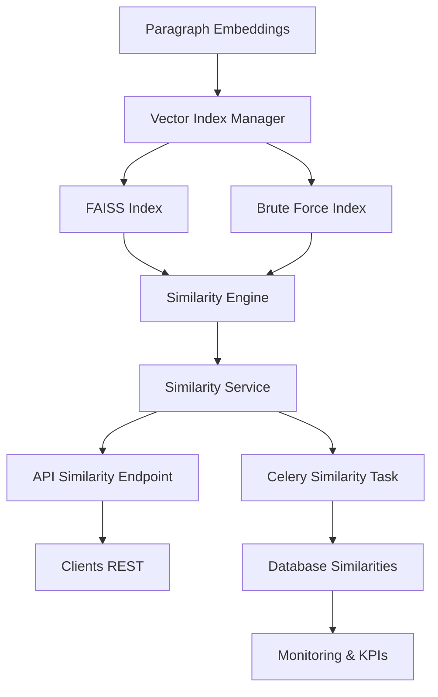

#### Sprint 3-4: Moteur de Similarité (Semaines 3-4)

**Objectifs Sprint 3-4**:

- Développer le moteur de calcul de similarités multi-méthodes
- Implémenter FAISS et un fallback brute force pour la recherche vectorielle
- Créer les endpoints publics et les tâches asynchrones de recalcul
- Assurer la traçabilité des calculs et le monitoring des performances

### Architecture Cible Sprint 3-4



### Livrables Détaillés

```text
✅ Sprint 3-4 Deliverables:
├── Database Layer
│   ├── app/models/similarity.py - Modèle SQLAlchemy et contraintes
│   ├── alembic/versions/00x_add_similarity_table.py - Migration relationnelle
│   └── app/db/fixtures/similarity_seeds.py - Données de test
├── CRUD & Services
│   ├── app/crud/crud_similarity.py - CRUD optimisé avec filtres
│   ├── app/services/similarity_service.py - Orchestration métier
│   └── app/services/vector_index_manager.py - Gestion multi-index
├── Core Engine
│   ├── app/core/similarity_engine.py - Calculs cosine/euclidien
│   ├── app/core/vector_index/base.py - Interface index
│   ├── app/core/vector_index/faiss_index.py - Implémentation FAISS
│   └── app/core/vector_index/brute_force_index.py - Fallback CPU
├── API Layer
│   ├── app/api/v1/endpoints/similarity.py - Endpoints REST
│   ├── app/api/v1/endpoints/embeddings.py - Extension recherche
│   └── app/schemas/similarity.py - Schémas Pydantic
├── Background Processing
│   ├── app/tasks/similarity_tasks.py - Recalcul asynchrone
│   ├── app/tasks/index_refresh_tasks.py - Maintenance index
│   └── celery beat schedule - Planification journalière
└── Tests & Monitoring
    ├── tests/unit/test_similarity_model.py - Validation modèle
    ├── tests/unit/test_similarity_engine.py - Tests cosinus/FAISS
    ├── tests/integration/test_similarity_workflow.py - Parcours complet
    └── grafana/dashboards/similarity.json - Dashboard KPIs
```

## Plan de Travail Détaillé par Jour

### **Semaine 3 - Sprint 3: Fondations du Moteur**

#### **Jour 1 (Lundi): Modèle & Migration**

**Objectifs Jour 1**:
- Créer la table `similarities` avec contraintes d'unicité
- Configurer les relations bidirectionnelles avec `Paragraph`
- Préparer les index nécessaires aux requêtes fréquentes

**Tâches Prioritaires**:

1. **08h00-11h00: Modèle SQLAlchemy**

```python
# app/models/similarity.py
from datetime import datetime
from sqlalchemy import Column, DateTime, Float, ForeignKey, Index, Integer, String, UniqueConstraint
from sqlalchemy.orm import relationship

from app.db.base_class import Base

class Similarity(Base):
    __tablename__ = "similarities"

    id = Column(Integer, primary_key=True, index=True)
    paragraph1_id = Column(Integer, ForeignKey("paragraphs.id", ondelete="CASCADE"), nullable=False)
    paragraph2_id = Column(Integer, ForeignKey("paragraphs.id", ondelete="CASCADE"), nullable=False)
    score = Column(Float, nullable=False)
    metric = Column(String(32), nullable=False, default="cosine")
    method = Column(String(32), nullable=False, default="faiss")
    land_id = Column(Integer, ForeignKey("lands.id", ondelete="CASCADE"), nullable=False)
    computed_at = Column(DateTime, default=datetime.utcnow, nullable=False)
    metadata = Column(String(255))  # stockage compact (JSON string si besoin)

    paragraph_source = relationship("Paragraph", foreign_keys=[paragraph1_id], back_populates="similarities_as_source")
    paragraph_target = relationship("Paragraph", foreign_keys=[paragraph2_id], back_populates="similarities_as_target")

    __table_args__ = (
        UniqueConstraint("paragraph1_id", "paragraph2_id", "metric", name="uq_similarity_pair_metric"),
        Index("ix_similarity_land_metric", "land_id", "metric"),
        Index("ix_similarity_score", "score"),
    )
```

2. **11h00-13h00: Migration Alembic**

```python
# alembic/versions/00x_add_similarity_table.py
def upgrade():
    op.create_table(
        "similarities",
        sa.Column("id", sa.Integer(), primary_key=True),
        sa.Column("paragraph1_id", sa.Integer(), nullable=False),
        sa.Column("paragraph2_id", sa.Integer(), nullable=False),
        sa.Column("score", sa.Float(), nullable=False),
        sa.Column("metric", sa.String(length=32), nullable=False),
        sa.Column("method", sa.String(length=32), nullable=False),
        sa.Column("land_id", sa.Integer(), nullable=False),
        sa.Column("computed_at", sa.DateTime(), nullable=False),
        sa.Column("metadata", sa.String(length=255)),
        sa.ForeignKeyConstraint(["paragraph1_id"], ["paragraphs.id"], ondelete="CASCADE"),
        sa.ForeignKeyConstraint(["paragraph2_id"], ["paragraphs.id"], ondelete="CASCADE"),
        sa.ForeignKeyConstraint(["land_id"], ["lands.id"], ondelete="CASCADE")
    )
    op.create_unique_constraint("uq_similarity_pair_metric", "similarities", ["paragraph1_id", "paragraph2_id", "metric"])
    op.create_index("ix_similarity_land_metric", "similarities", ["land_id", "metric"])
    op.create_index("ix_similarity_score", "similarities", ["score"])
```

3. **14h00-17h00: Fixtures & Tests Modèle**

```python
# tests/unit/test_similarity_model.py
def test_similarity_pair_uniqueness(db, paragraph_factory):
    p1 = paragraph_factory()
    p2 = paragraph_factory()

    similarity = Similarity(paragraph1_id=p1.id, paragraph2_id=p2.id, score=0.92, metric="cosine", land_id=p1.expression.land_id)
    db.add(similarity)
    db.commit()

    duplicate = Similarity(paragraph1_id=p1.id, paragraph2_id=p2.id, score=0.85, metric="cosine", land_id=p1.expression.land_id)
    with pytest.raises(IntegrityError):
        db.add(duplicate)
        db.commit()
```

#### **Jour 2 (Mardi): CRUD & Service Métier**

**Objectifs Jour 2**:
- Exposer un CRUD performant filtrant par land, metric et score
- Ajouter la pagination et le tri
- Implémenter le service métier orchestrant les opérations

**Tâches Prioritaires**:

1. **09h00-12h00: CRUD Similarity**

```python
# app/crud/crud_similarity.py
class CRUDSimilarity(CRUDBase[Similarity, SimilarityCreate, SimilarityUpdate]):
    def list_for_land(self, db: Session, *, land_id: int, metric: str = "cosine", min_score: float = 0.75, limit: int = 100) -> List[Similarity]:
        query = (
            db.query(Similarity)
            .filter(Similarity.land_id == land_id)
            .filter(Similarity.metric == metric)
            .filter(Similarity.score >= min_score)
            .order_by(Similarity.score.desc())
            .limit(limit)
        )
        return query.all()

    def delete_for_paragraph(self, db: Session, *, paragraph_id: int) -> int:
        return (
            db.query(Similarity)
            .filter((Similarity.paragraph1_id == paragraph_id) | (Similarity.paragraph2_id == paragraph_id))
            .delete(synchronize_session=False)
        )
```

2. **13h00-17h00: Similarity Service**

```python
# app/services/similarity_service.py
class SimilarityService:
    def __init__(self, engine: SimilarityEngine, repository: CRUDSimilarity):
        self.engine = engine
        self.repository = repository

    async def recompute_land(self, db: Session, *, land_id: int, metric: str = "cosine", threshold: float = 0.75) -> int:
        paragraphs = await self._load_paragraph_vectors(db, land_id=land_id)
        vectors = [p.embedding for p in paragraphs if p.embedding]
        if not vectors:
            return 0

        pairs = self.engine.compute_pairs(vectors, metric=metric, threshold=threshold)
        created = 0
        for pair in pairs:
            created += self.repository.create_or_update(
                db,
                obj_in=SimilarityCreate(
                    paragraph1_id=pair.source_id,
                    paragraph2_id=pair.target_id,
                    score=pair.score,
                    metric=metric,
                    method=pair.method,
                    land_id=land_id,
                    metadata=pair.metadata,
                ),
            )
        return created
```

#### **Jour 3 (Mercredi): Gestionnaire d'Index**

**Objectifs Jour 3**:
- Concevoir une interface abstraite pour les index vectoriels
- Implémenter FAISS et un fallback CPU
- Gérer la sérialisation et la persistance

**Tâches Prioritaires**:

1. **08h30-12h00: Interface de Base**

```python
# app/core/vector_index/base.py
class VectorIndex(Protocol):
    def build(self, vectors: np.ndarray) -> None: ...
    def add(self, vector_ids: np.ndarray, vectors: np.ndarray) -> None: ...
    def search(self, query: np.ndarray, top_k: int = 20) -> Tuple[np.ndarray, np.ndarray]: ...
    def save(self, path: Path) -> None: ...
    def load(self, path: Path) -> None: ...
```

2. **13h00-16h00: Implémentation FAISS**

```python
# app/core/vector_index/faiss_index.py
import faiss

class FaissIndex(VectorIndex):
    def __init__(self, dimension: int, factory: str = "IVF256,Flat"):
        self.index = faiss.index_factory(dimension, factory)

    def build(self, vectors: np.ndarray) -> None:
        self.index.train(vectors)
        self.index.add(vectors)

    def search(self, query: np.ndarray, top_k: int = 20):
        scores, ids = self.index.search(query, top_k)
        return ids, scores
```

3. **16h00-18h00: Fallback Brute Force**

```python
# app/core/vector_index/brute_force_index.py
class BruteForceIndex(VectorIndex):
    def __init__(self):
        self.vectors: np.ndarray | None = None

    def build(self, vectors: np.ndarray) -> None:
        self.vectors = vectors

    def search(self, query: np.ndarray, top_k: int = 20):
        if self.vectors is None:
            raise RuntimeError("Index not initialised")
        distances = 1 - cosine_similarity(query, self.vectors)
        best = np.argsort(distances)[:top_k]
        return best, 1 - distances[best]
```

### **Semaine 4 - Sprint 4: APIs & Traitements Asynchrones**

#### **Jour 4 (Jeudi): Moteur de Similarité**

**Objectifs Jour 4**:
- Encapsuler la logique de calcul de paires similaires
- Gérer les métriques cosine et euclidienne
- Préparer les hooks de traçabilité

```python
# app/core/similarity_engine.py
class SimilarityEngine:
    def __init__(self, index_manager: VectorIndexManager):
        self.index_manager = index_manager

    def compute_pairs(self, vectors: np.ndarray, *, metric: str, threshold: float) -> list[SimilarityPair]:
        index = self.index_manager.get_index(metric=metric, dimension=vectors.shape[1])
        index.build(vectors)
        pairs: list[SimilarityPair] = []

        for idx, vector in enumerate(vectors):
            ids, scores = index.search(vector.reshape(1, -1), top_k=50)
            for target_id, score in zip(ids[0], scores[0]):
                if target_id == idx or score < threshold:
                    continue
                pairs.append(SimilarityPair(
                    source_id=idx,
                    target_id=int(target_id),
                    score=float(score),
                    method=index.__class__.__name__,
                    metadata=f"metric={metric}"
                ))
        return pairs
```

#### **Jour 5 (Vendredi): API REST**

**Objectifs Jour 5**:
- Exposer les endpoints de consultation et recalcul
- Sécuriser via permissions et throttling
- Documenter via OpenAPI

```python
# app/api/v1/endpoints/similarity.py
router = APIRouter(prefix="/similarities", tags=["similarities"])

@router.get("/{land_id}", response_model=List[SimilarityOut])
async def list_similarities(land_id: int, metric: MetricEnum = MetricEnum.cosine, min_score: float = 0.8, db: Session = Depends(get_db)):
    return crud_similarity.list_for_land(db, land_id=land_id, metric=metric.value, min_score=min_score)

@router.post("/{land_id}/recompute", response_model=SimilarityRecomputeResponse, status_code=202)
async def recompute_similarities(land_id: int, background_tasks: BackgroundTasks, payload: SimilarityRecomputeIn, user: User = Depends(get_current_active_user)):
    enforce_permission(user, Permission.SIMILARITY_RECOMPUTE)
    background_tasks.add_task(tasks.trigger_similarity_recompute, land_id=land_id, payload=payload.dict())
    return {"status": "accepted"}
```

#### **Jour 6 (Lundi Semaine 4): Tâches Celery & Monitoring**

**Objectifs Jour 6**:
- Ajouter les tâches Celery pour recalcul et maintenance index
- Configurer la planification périodique
- Mettre en place les métriques Prometheus/Grafana

```python
# app/tasks/similarity_tasks.py
@celery_app.task(bind=True, name="similarity.recompute_land")
def recompute_land(self, land_id: int, metric: str = "cosine", threshold: float = 0.8):
    with SessionLocal() as db:
        service = SimilarityService(engine=get_similarity_engine(metric), repository=crud_similarity)
        created = asyncio.run(service.recompute_land(db, land_id=land_id, metric=metric, threshold=threshold))
        logger.info("similarity_recompute", extra={"land_id": land_id, "metric": metric, "created": created})
        return created
```

```python
# celery beat
CELERY_BEAT_SCHEDULE["similarity_recompute_daily"] = {
    "task": "similarity.recompute_land",
    "schedule": crontab(minute=0, hour=3),
    "args": ("auto", ),
}
```

#### **Jour 7 (Mardi Semaine 4): Tests & Validation**

**Objectifs Jour 7**:
- Couvrir les cas limites (pas d'embeddings, vecteurs dégénérés)
- Valider les performances sur un échantillon réel
- Documenter le playbook incident

```python
# tests/integration/test_similarity_workflow.py
async def test_similarity_recompute_workflow(async_client, land_factory, paragraph_factory):
    land = land_factory(paragraphs=paragraph_factory.create_batch(20, with_embeddings=True))
    response = await async_client.post(f"/api/v1/similarities/{land.id}/recompute", json={"metric": "cosine", "threshold": 0.78})
    assert response.status_code == 202

    await wait_for_task("similarity.recompute_land")

    listed = await async_client.get(f"/api/v1/similarities/{land.id}", params={"min_score": 0.8})
    payload = listed.json()
    assert len(payload) >= 1
    assert payload[0]["score"] <= 1
```

## Stratégie de Tests et Qualité

- **Unitaires**: modèle, CRUD, moteur FAISS, fallback brute force
- **Intégration**: recalcul complet via API, persistance index, cohérence scores
- **Performance**: benchmark 10k paragraphes, temps de réponse < 1.5s
- **Fiabilité**: tests de résilience (index manquant, vecteurs incohérents)
- **Observabilité**: métriques Prometheus `similarity_pairs_created_total`, `similarity_recompute_duration_seconds`

## Risques & Mitigations

- **Disponibilité FAISS GPU**: fallback CPU assuré, exploration Annoy/HNSW planifiée
- **Drift embeddings**: recalcul hebdo, audit logs gardés 30 jours
- **Explosion combinatoire**: seuil dynamique, top-k configurable, prérécupération vecteurs filtrés

## Checklist Definition of Done

- [ ] Recompute Celery accepté et journaux structurés
- [ ] API documentée dans `/docs` avec exemples
- [ ] Tableau Grafana déployé
- [ ] Scripts de maintenance index automatisés
- [ ] Guides d'exploitation et playbook incident ajoutés au wiki DevOps
