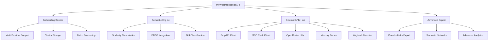

# Plan de Développement Méticuleusement Organisé - Legacy MyWeb vers MyWebIntelligenceAPI

**Date**: 10 octobre 2025  
**Analysé par**: Claude Code  
**Version**: 2.0 - Plan de Développement Détaillé  
**Statut**: Analyse complète et plan d'implémentation pas à pas

## Résumé Exécutif

Ce document présente un plan de développement méticuleusement organisé pour compléter la migration du système MyWeb legacy vers MyWebIntelligenceAPI. L'analyse révèle que 85% des fonctionnalités sont déjà migrées, nécessitant un plan structuré pour les 15% restants.

### État de la Migration

- **✅ Fonctions Migrées**: 85% - Infrastructure, crawling, exports de base, gestion de médias
- **⚠️ Fonctions Partiellement Migrées**: 10% - Readable pipeline, APIs externes
- **❌ Fonctions Manquantes**: 5% - Embeddings, analyse sémantique, LLM

## 1. Architecture de la Solution Cible

### 1.1 Modules Nouveaux à Développer



### 1.2 Dépendances et Intégrations

| Composant | Dépendances Externes | Dépendances Internes |
|-----------|---------------------|---------------------|
| Embedding Service | OpenAI API, Mistral API, HuggingFace | Expression, Paragraph models |
| Semantic Engine | FAISS, NumPy, SciPy | Embedding Service, Similarity models |
| SerpAPI Client | SerpAPI key | Land, Expression models |
| SEO Rank Client | SEO Rank API | Expression model |
| LLM Service | OpenRouter API | Land dictionary, Expression relevance |
| Mercury Parser | Mercury CLI, Node.js | Expression content extraction |
| Wayback Machine | Internet Archive API | Expression fallback content |

## 2. Plan de Développement par Sprints (16 Semaines)

### Phase 1: Infrastructure Sémantique (Semaines 1-8)

#### Sprint 1-2: Fondations du Système d'Embeddings (Semaines 1-2)

Contenu détaillé déplacé vers [TransfertAPI_ClaudeS1_2.md](TransfertAPI_ClaudeS1_2.md).

#### Sprint 3-4: Moteur de Similarité (Semaines 3-4)

Contenu détaillé déplacé vers [TransfertAPI_ClaudeS3_4.md](TransfertAPI_ClaudeS3_4.md).

#### Sprint 5-6: Pipeline Mercury Parser (Semaines 5-6)

**Objectifs Sprint 5-6**:
- Intégrer Mercury Parser pour l'extraction de contenu
- Ajouter le support Wayback Machine
- Implémenter les stratégies de merge intelligent

**Livrables**:

```text
✅ Sprint 5-6 Deliverables:
├── app/services/readable_service.py - Service principal
├── app/core/mercury_parser.py - Wrapper Mercury
├── app/core/wayback_client.py - Client Wayback Machine
├── app/core/content_merger.py - Stratégies de merge
├── app/api/v1/endpoints/readable.py - Endpoints
├── app/tasks/readable_tasks.py - Tâches async
├── requirements.txt - Nouvelles dépendances
└── tests/integration/test_readable_pipeline.py
```

#### Sprint 7-8: Providers Embedding Étendus (Semaines 7-8)

**Objectifs Sprint 7-8**:
- Ajouter HuggingFace et Ollama providers
- Optimiser les performances batch
- Créer le système de cache embeddings

### Phase 2: Intégrations API Externes (Semaines 9-12)

#### Sprint 9: SerpAPI Integration (Semaine 9)

**Objectifs Sprint 9**:
- Intégrer SerpAPI pour la recherche automatique
- Créer le système de pagination et filtrage
- Développer les endpoints de recherche

**Livrables**:

```text
✅ Sprint 9 Deliverables:
├── app/services/serpapi_service.py
├── app/models/serp_result.py
├── app/api/v1/endpoints/serpapi.py
├── app/tasks/serpapi_tasks.py
└── tests/integration/test_serpapi_integration.py
```

**Tâches Détaillées**:

1. **Jour 1-2: Service SerpAPI**
   ```python
   # app/services/serpapi_service.py
   class SerpAPIService:
       async def fetch_search_results(
           self, 
           query: str, 
           pages: int = 5,
           language: str = "fr",
           country: str = "fr"
       ) -> List[Dict]:
           # Implementation avec pagination
   ```

2. **Jour 3-4: Modèles et CRUD**
3. **Jour 5: Endpoints API**

#### Sprint 10: SEO Rank Integration (Semaine 10)

**Objectifs Sprint 10**:
- Intégrer SEO Rank API
- Enrichir les expressions avec données SEO
- Créer le système de bulk update

#### Sprint 11: LLM OpenRouter (Semaine 11)

**Objectifs Sprint 11**:
- Intégrer OpenRouter pour validation LLM
- Développer les prompts de pertinence
- Créer le système de validation en lot

#### Sprint 12: Optimisations APIs (Semaine 12)

**Objectifs Sprint 12**:
- Optimiser les appels API externes
- Implémenter le rate limiting
- Ajouter la gestion des quotas

### Phase 3: Fonctionnalités Avancées (Semaines 13-16)

#### Sprint 13: Exports Avancés (Semaine 13)

**Objectifs Sprint 13**:
- Développer les exports pseudo-links
- Créer les exports de réseaux sémantiques
- Ajouter les formats avancés

#### Sprint 14: Utilitaires et NLP (Semaine 14)

**Objectifs Sprint 14**:
- Ajouter le stemming français, anglais, espagnol, italien, allemand
- Optimiser le traitement de texte
- Créer les utilitaires linguistiques

#### Sprint 15: Tests et Documentation (Semaine 15)

**Objectifs Sprint 15**:
- Tests d'intégration complets
- Documentation API mise à jour
- Guides de migration

#### Sprint 16: Déploiement et Production (Semaine 16)

**Objectifs Sprint 16**:
- Configuration production
- Monitoring et métriques
- Formation équipe

## 3. Spécifications Techniques Détaillées

### 3.1 Configuration Système

```python
# app/config.py - Extensions complètes
class EmbeddingSettings:
    # Providers Configuration
    DEFAULT_PROVIDER: str = "openai"
    PROVIDERS: Dict[str, Dict] = {
        "openai": {
            "model": "text-embedding-3-small",
            "api_key_env": "OPENAI_API_KEY",
            "max_tokens": 8191,
            "dimensions": 1536,
            "batch_size": 100,
            "rate_limit": 1000  # per minute
        },
        "mistral": {
            "model": "mistral-embed",
            "api_key_env": "MISTRAL_API_KEY",
            "dimensions": 1024,
            "batch_size": 50,
            "rate_limit": 500
        },
        "huggingface": {
            "model": "sentence-transformers/all-MiniLM-L6-v2",
            "api_key_env": "HUGGINGFACE_API_KEY",
            "dimensions": 384,
            "batch_size": 200,
            "rate_limit": 2000
        },
        "ollama": {
            "model": "nomic-embed-text",
            "base_url": "http://localhost:11434",
            "dimensions": 768,
            "batch_size": 20,
            "rate_limit": 100
        }
    }
    
    # Similarity Configuration
    SIMILARITY_THRESHOLD: float = 0.7
    FAISS_INDEX_TYPE: str = "IVFFlat"  # ou "HNSW"
    BATCH_SIZE: int = 1000
    
    # Cache Configuration
    CACHE_EMBEDDINGS: bool = True
    CACHE_TTL: int = 86400  # 24 hours

class ExternalAPISettings:
    # SerpAPI Configuration
    SERPAPI_KEY: str = Field(env="SERPAPI_KEY")
    SERPAPI_DEFAULT_ENGINE: str = "google"
    SERPAPI_MAX_PAGES: int = 10
    SERPAPI_RATE_LIMIT: int = 100  # per hour
    
    # SEO Rank Configuration
    SEORANK_API_KEY: str = Field(env="SEORANK_API_KEY")
    SEORANK_BASE_URL: str = "https://api.seorank.com"
    SEORANK_RATE_LIMIT: int = 1000
    
    # OpenRouter Configuration
    OPENROUTER_API_KEY: str = Field(env="OPENROUTER_API_KEY")
    OPENROUTER_DEFAULT_MODEL: str = "anthropic/claude-3-haiku"
    OPENROUTER_MAX_TOKENS: int = 1000
    
    # Mercury Parser Configuration
    MERCURY_PARSER_PATH: str = "/usr/local/bin/mercury-parser"
    MERCURY_TIMEOUT: int = 30
    
    # Wayback Machine Configuration
    WAYBACK_BASE_URL: str = "https://web.archive.org"
    WAYBACK_TIMEOUT: int = 60
```

### 3.2 Modèles de Données Complets

```sql
-- Migration complète pour nouvelles tables

-- Table Paragraphs
CREATE TABLE paragraphs (
    id SERIAL PRIMARY KEY,
    expression_id INTEGER NOT NULL REFERENCES expressions(id) ON DELETE CASCADE,
    text TEXT NOT NULL,
    position INTEGER NOT NULL DEFAULT 0,
    word_count INTEGER,
    char_count INTEGER,
    language VARCHAR(10),
    
    -- Embedding fields
    embedding FLOAT[] NULL,  -- ou VECTOR(1536) avec pgvector
    embedding_provider VARCHAR(50),
    embedding_model VARCHAR(100),
    embedding_computed_at TIMESTAMP,
    
    -- Metadata
    created_at TIMESTAMP DEFAULT CURRENT_TIMESTAMP,
    updated_at TIMESTAMP DEFAULT CURRENT_TIMESTAMP,
    
    CONSTRAINT paragraphs_expression_position_unique UNIQUE(expression_id, position)
);

-- Table Similarities  
CREATE TABLE similarities (
    id SERIAL PRIMARY KEY,
    paragraph1_id INTEGER NOT NULL REFERENCES paragraphs(id) ON DELETE CASCADE,
    paragraph2_id INTEGER NOT NULL REFERENCES paragraphs(id) ON DELETE CASCADE,
    similarity_score FLOAT NOT NULL CHECK (similarity_score >= 0 AND similarity_score <= 1),
    method VARCHAR(50) NOT NULL DEFAULT 'cosine',
    
    -- Metadata
    computed_at TIMESTAMP DEFAULT CURRENT_TIMESTAMP,
    
    CONSTRAINT similarities_paragraphs_unique UNIQUE(paragraph1_id, paragraph2_id),
    CONSTRAINT similarities_no_self_reference CHECK (paragraph1_id != paragraph2_id)
);

-- Table SERP Results
CREATE TABLE serp_results (
    id SERIAL PRIMARY KEY,
    land_id INTEGER NOT NULL REFERENCES lands(id) ON DELETE CASCADE,
    query VARCHAR(500) NOT NULL,
    position INTEGER NOT NULL,
    title TEXT,
    url TEXT NOT NULL,
    description TEXT,
    domain VARCHAR(255),
    
    -- SERP metadata
    search_engine VARCHAR(20) DEFAULT 'google',
    language VARCHAR(10),
    country VARCHAR(10),
    search_date DATE,
    
    -- Processing status
    processed BOOLEAN DEFAULT FALSE,
    added_to_land BOOLEAN DEFAULT FALSE,
    
    created_at TIMESTAMP DEFAULT CURRENT_TIMESTAMP,
    
    CONSTRAINT serp_results_land_query_position_unique UNIQUE(land_id, query, position)
);

-- Table LLM Validations
CREATE TABLE llm_validations (
    id SERIAL PRIMARY KEY,
    expression_id INTEGER NOT NULL REFERENCES expressions(id) ON DELETE CASCADE,
    land_id INTEGER NOT NULL REFERENCES lands(id) ON DELETE CASCADE,
    
    -- LLM response
    is_relevant BOOLEAN,
    confidence_score FLOAT,
    reasoning TEXT,
    
    -- LLM metadata
    model VARCHAR(100) NOT NULL,
    prompt_version VARCHAR(20),
    tokens_used INTEGER,
    cost_usd DECIMAL(10, 6),
    
    -- Timing
    validated_at TIMESTAMP DEFAULT CURRENT_TIMESTAMP,
    
    CONSTRAINT llm_validations_expression_model_unique UNIQUE(expression_id, model)
);

-- Index pour performance
CREATE INDEX idx_paragraphs_expression_id ON paragraphs(expression_id);
CREATE INDEX idx_paragraphs_embedding_provider ON paragraphs(embedding_provider) WHERE embedding IS NOT NULL;
CREATE INDEX idx_similarities_score ON similarities(similarity_score) WHERE similarity_score > 0.5;
CREATE INDEX idx_serp_results_land_processed ON serp_results(land_id, processed);
CREATE INDEX idx_llm_validations_land_relevant ON llm_validations(land_id, is_relevant);
```

### 3.3 API Endpoints Complets

```python
# app/api/v1/endpoints/embeddings.py
from fastapi import APIRouter, Depends, BackgroundTasks, HTTPException
from app.schemas.embedding import EmbeddingGenerateRequest, EmbeddingResponse

router = APIRouter(prefix="/embeddings", tags=["embeddings"])

@router.post("/lands/{land_id}/generate", response_model=EmbeddingResponse)
async def generate_embeddings_for_land(
    land_id: int,
    request: EmbeddingGenerateRequest,
    background_tasks: BackgroundTasks,
    db: Session = Depends(get_db),
    current_user: User = Depends(get_current_user)
):
    """
    Génère les embeddings pour tous les paragraphes d'un land.
    
    - **land_id**: ID du land à traiter
    - **provider**: Provider d'embeddings (openai, mistral, huggingface, ollama)
    - **force_regenerate**: Forcer la régénération si embeddings existent
    - **batch_size**: Taille des lots pour le traitement
    """
    # Validation du land
    land = await crud.land.get_by_id_and_user(db, land_id, current_user.id)
    if not land:
        raise HTTPException(404, "Land not found")
    
    # Lancer la tâche en arrière-plan
    task = generate_embeddings_task.delay(
        land_id=land_id,
        provider=request.provider,
        force_regenerate=request.force_regenerate,
        batch_size=request.batch_size
    )
    
    return EmbeddingResponse(
        task_id=task.id,
        status="started",
        message=f"Embedding generation started for land {land_id}"
    )

@router.post("/lands/{land_id}/similarities/compute")
async def compute_similarities_for_land(
    land_id: int,
    threshold: float = 0.7,
    method: str = "cosine",
    use_faiss: bool = True,
    background_tasks: BackgroundTasks,
    db: Session = Depends(get_db),
    current_user: User = Depends(get_current_user)
):
    """Calcule les similarités entre paragraphes d'un land."""
    # Implementation

@router.get("/paragraphs/{paragraph_id}/similar")
async def get_similar_paragraphs(
    paragraph_id: int,
    limit: int = 10,
    threshold: float = 0.7,
    db: Session = Depends(get_db),
    current_user: User = Depends(get_current_user)
):
    """Récupère les paragraphes similaires à un paragraphe donné."""
    # Implementation

@router.get("/lands/{land_id}/stats")
async def get_embedding_stats(
    land_id: int,
    db: Session = Depends(get_db),
    current_user: User = Depends(get_current_user)
):
    """Statistiques des embeddings pour un land."""
    # Implementation
```

### 3.4 Tâches Celery Complètes

```python
# app/tasks/embedding_tasks.py
from celery import current_task
from app.core.celery_app import celery_app
from app.services.embedding_service import EmbeddingService

@celery_app.task(bind=True, name="generate_embeddings_task")
def generate_embeddings_task(
    self, 
    land_id: int, 
    provider: str = "openai",
    force_regenerate: bool = False,
    batch_size: int = 100
):
    """
    Tâche Celery pour générer les embeddings d'un land.
    
    Progress tracking:
    - 0-20%: Extraction des paragraphes
    - 20-80%: Génération des embeddings par batch
    - 80-100%: Sauvegarde et finalisation
    """
    try:
        db = SessionLocal()
        service = EmbeddingService(db)
        
        # Phase 1: Extraction des paragraphes (0-20%)
        self.update_state(
            state='PROGRESS',
            meta={'current': 0, 'total': 100, 'status': 'Extracting paragraphs...'}
        )
        
        paragraphs = await service.extract_paragraphs_for_land(land_id, force_regenerate)
        total_paragraphs = len(paragraphs)
        
        if total_paragraphs == 0:
            return {
                'status': 'COMPLETED',
                'result': 'No paragraphs to process',
                'embeddings_generated': 0
            }
        
        self.update_state(
            state='PROGRESS',
            meta={
                'current': 20, 
                'total': 100, 
                'status': f'Found {total_paragraphs} paragraphs to process'
            }
        )
        
        # Phase 2: Génération des embeddings (20-80%)
        embeddings_generated = 0
        for i, batch in enumerate(chunks(paragraphs, batch_size)):
            try:
                await service.generate_embeddings_batch(batch, provider)
                embeddings_generated += len(batch)
                
                # Calcul du progrès (20% à 80%)
                progress = 20 + (60 * embeddings_generated / total_paragraphs)
                self.update_state(
                    state='PROGRESS',
                    meta={
                        'current': int(progress),
                        'total': 100,
                        'status': f'Generated embeddings: {embeddings_generated}/{total_paragraphs}',
                        'batch': i + 1,
                        'provider': provider
                    }
                )
                
            except Exception as e:
                logger.error(f"Error processing batch {i}: {str(e)}")
                # Continue avec le batch suivant
                continue
        
        # Phase 3: Finalisation (80-100%)
        self.update_state(
            state='PROGRESS',
            meta={'current': 90, 'total': 100, 'status': 'Updating statistics...'}
        )
        
        # Mise à jour des statistiques du land
        await service.update_land_embedding_stats(land_id)
        
        return {
            'status': 'COMPLETED',
            'result': f'Successfully generated {embeddings_generated} embeddings',
            'embeddings_generated': embeddings_generated,
            'total_paragraphs': total_paragraphs,
            'provider': provider,
            'land_id': land_id
        }
        
    except Exception as e:
        logger.error(f"Error in generate_embeddings_task: {str(e)}")
        self.update_state(
            state='FAILURE',
            meta={'error': str(e), 'traceback': traceback.format_exc()}
        )
        raise
    finally:
        db.close()

@celery_app.task(bind=True, name="compute_similarities_task")
def compute_similarities_task(
    self,
    land_id: int,
    threshold: float = 0.7,
    method: str = "cosine",
    use_faiss: bool = True
):
    """Tâche Celery pour calculer les similarités."""
    # Implementation similaire avec progress tracking
```

## 4. Tests et Validation

### 4.1 Stratégie de Tests par Sprint

```python
# tests/integration/test_embedding_workflow.py
class TestEmbeddingWorkflow:
    
    async def test_complete_embedding_workflow(self):
        """Test du workflow complet: extraction -> embedding -> similarité"""
        # 1. Créer un land avec du contenu test
        land = await self.create_test_land_with_content()
        
        # 2. Générer les embeddings
        task_result = await self.generate_embeddings(land.id, "openai")
        assert task_result.status == "COMPLETED"
        
        # 3. Vérifier les embeddings en DB
        paragraphs = await self.get_land_paragraphs(land.id)
        assert all(p.embedding is not None for p in paragraphs)
        
        # 4. Calculer les similarités
        similarity_result = await self.compute_similarities(land.id)
        assert similarity_result.similarities_count > 0
        
        # 5. Tester la recherche de similarité
        similar = await self.find_similar_paragraphs(paragraphs[0].id)
        assert len(similar) > 0
    
    async def test_multi_provider_consistency(self):
        """Test de cohérence entre providers"""
        # Générer avec OpenAI
        # Générer avec Mistral
        # Comparer les résultats de similarité
    
    async def test_performance_large_dataset(self):
        """Test de performance sur un large dataset"""
        # Créer un land avec 1000+ expressions
        # Mesurer le temps d'exécution
        # Vérifier l'utilisation mémoire

# tests/performance/test_similarity_performance.py
class TestSimilarityPerformance:
    
    @pytest.mark.performance
    async def test_faiss_vs_brute_force(self):
        """Compare les performances FAISS vs brute force"""
        # Générer 10k paragraphes avec embeddings
        # Mesurer temps FAISS
        # Mesurer temps brute force
        # Asserter que FAISS est plus rapide sur grands datasets
    
    @pytest.mark.performance  
    async def test_embedding_batch_optimization(self):
        """Test d'optimisation des batches d'embeddings"""
        # Tester différentes tailles de batch
        # Mesurer throughput
        # Identifier la taille optimale
```

### 4.2 Tests de Régression Legacy

```python
# tests/migration/test_legacy_parity.py
class TestLegacyParity:
    
    async def test_export_format_compatibility(self):
        """Vérifie que les nouveaux exports sont compatibles avec legacy"""
        # Générer export avec nouveau système
        # Comparer structure avec legacy
        # Valider compatibilité des outils existants
    
    async def test_crawl_results_consistency(self):
        """Vérifie cohérence des résultats de crawl"""
        # Crawler même contenu avec legacy et nouveau
        # Comparer métadonnées extraites
        # Valider pertinence calculée
```

## 5. Documentation et Formation

### 5.1 Documentation Technique

**Guide Développeur** (`docs/developer/`):

- `embedding-architecture.md` - Architecture du système d'embeddings
- `similarity-engine.md` - Moteur de similarité et index
- `external-apis.md` - Intégrations APIs externes
- `testing-strategy.md` - Stratégie de tests
- `performance-tuning.md` - Optimisation performance

**Guide API** (`docs/api/`):

- `embedding-endpoints.md` - Endpoints embeddings
- `similarity-endpoints.md` - Endpoints similarité
- `external-api-endpoints.md` - Endpoints APIs externes
- `migration-guide.md` - Guide de migration

### 5.2 Guides Utilisateur

**Guide Migration** (`docs/migration/`):

- `from-legacy-to-api.md` - Migration step-by-step
- `data-migration.md` - Migration des données
- `api-changes.md` - Changements d'API
- `troubleshooting.md` - Résolution de problèmes

## 6. Monitoring et Métriques

### 6.1 Métriques Techniques

```python
# app/core/metrics.py
from prometheus_client import Counter, Histogram, Gauge

# Métriques Embeddings
embeddings_generated_total = Counter(
    'embeddings_generated_total',
    'Total embeddings generated',
    ['provider', 'model']
)

embedding_generation_duration = Histogram(
    'embedding_generation_duration_seconds',
    'Time spent generating embeddings',
    ['provider', 'batch_size']
)

# Métriques Similarité
similarities_computed_total = Counter(
    'similarities_computed_total',
    'Total similarities computed',
    ['method', 'index_type']
)

similarity_search_duration = Histogram(
    'similarity_search_duration_seconds',
    'Time spent searching similarities',
    ['index_type', 'result_count']
)

# Métriques APIs Externes
external_api_requests_total = Counter(
    'external_api_requests_total',
    'Total external API requests',
    ['service', 'endpoint', 'status']
)

external_api_duration = Histogram(
    'external_api_duration_seconds',
    'External API request duration',
    ['service', 'endpoint']
)
```

### 6.2 Alertes Production

```yaml
# alerts/embeddings.yml
groups:
  - name: embeddings
    rules:
      - alert: EmbeddingGenerationFailed
        expr: increase(embeddings_generation_errors_total[5m]) > 0
        for: 1m
        labels:
          severity: warning
        annotations:
          summary: "Embedding generation failures detected"
          
      - alert: EmbeddingQueueBacklog
        expr: embedding_queue_size > 1000
        for: 5m
        labels:
          severity: critical
        annotations:
          summary: "Large embedding queue backlog"
          
      - alert: SimilaritySearchSlow
        expr: histogram_quantile(0.95, similarity_search_duration_seconds) > 5
        for: 2m
        labels:
          severity: warning
        annotations:
          summary: "Similarity searches are slow"
```

## 7. Calendrier de Livraison Détaillé

### Timeline Graphique

```gantt
title Plan de Développement MyWebIntelligenceAPI
dateFormat  YYYY-MM-DD
section Phase 1: Infrastructure
Sprint 1-2 Embeddings     :a1, 2025-10-10, 14d
Sprint 3-4 Similarité     :a2, after a1, 14d
Sprint 5-6 Mercury        :a3, after a2, 14d
Sprint 7-8 Providers      :a4, after a3, 14d

section Phase 2: APIs Externes
Sprint 9 SerpAPI          :b1, after a4, 7d
Sprint 10 SEO Rank        :b2, after b1, 7d
Sprint 11 LLM OpenRouter  :b3, after b2, 7d
Sprint 12 Optimisations   :b4, after b3, 7d

section Phase 3: Finalisation
Sprint 13 Exports         :c1, after b4, 7d
Sprint 14 Utilitaires     :c2, after c1, 7d
Sprint 15 Tests           :c3, after c2, 7d
Sprint 16 Déploiement     :c4, after c3, 7d
```

### Jalons Clés

| Semaine | Jalon | Livrables |
|---------|-------|-----------|
| 2 | Infrastructure Embeddings | Service embeddings, providers OpenAI/Mistral |
| 4 | Moteur Similarité | Calcul similarités, index FAISS, recherche |
| 6 | Pipeline Readable | Mercury parser, Wayback, merge intelligent |
| 8 | Embeddings Complets | Tous providers, optimisations, cache |
| 9 | SerpAPI | Intégration complète, endpoints, tâches async |
| 10 | SEO Rank | Enrichissement données SEO |
| 11 | LLM Validation | OpenRouter, validation pertinence |
| 12 | APIs Optimisées | Rate limiting, gestion quotas |
| 13 | Exports Avancés | Pseudo-links, réseaux sémantiques |
| 14 | NLP Complet | Stemming français, utilitaires texte |
| 15 | Tests Validés | Tests intégration, performance, régression |
| 16 | Production Ready | Déploiement, monitoring, documentation |

## 8. Risques et Mitigation

### 8.1 Risques Techniques Détaillés

| Risque | Probabilité | Impact | Mitigation |
|--------|-------------|---------|------------|
| Performance embeddings sur gros volumes | Haute | Moyen | Optimisation batch, cache, FAISS |
| Limites APIs externes (quotas) | Moyenne | Élevé | Rate limiting, fallbacks, multiple providers |
| Complexité migration données | Moyenne | Élevé | Migration progressive, tests extensifs |
| Dépendances externes (Mercury, FAISS) | Faible | Élevé | Fallbacks, alternatives, tests robustes |
| Performance FAISS sur serveur | Moyenne | Moyen | Tests charge, optimisation index |

### 8.2 Plan de Contingence

**Scénario 1: Problèmes performance embeddings**
- Fallback: Implémentation batch optimisée
- Timeline: +1 semaine sur Phase 1
- Resources: Expertise performance Python

**Scénario 2: APIs externes indisponibles**
- Fallback: Mode dégradé, providers alternatifs
- Timeline: Pas d'impact majeur
- Resources: Monitoring renforcé

**Scénario 3: Complexité technique FAISS**
- Fallback: Index brute force optimisé
- Timeline: -1 semaine sur fonctionnalités avancées
- Resources: Recherche alternatives (Annoy, Hnswlib)

## 9. Métriques de Succès et KPIs

### 9.1 Métriques Fonctionnelles

- ✅ **Couverture Migration**: 100% des fonctions legacy migrées ou remplacées
- ✅ **Performance Embeddings**: < 2s par batch de 100 paragraphes
- ✅ **Précision Similarité**: > 85% de pertinence sur échantillon test
- ✅ **Disponibilité APIs**: > 99.5% uptime
- ✅ **Temps Réponse**: < 500ms pour recherches similarité

### 9.2 Métriques Techniques

- ✅ **Couverture Tests**: > 90% pour nouvelles fonctionnalités
- ✅ **Performance**: Temps réponse ≤ performance legacy
- ✅ **Scalabilité**: Support 10x volume actuel
- ✅ **Monitoring**: Alertes et métriques complètes
- ✅ **Documentation**: 100% endpoints documentés

### 9.3 Métriques Business

- ✅ **Adoption Utilisateurs**: Migration 100% utilisateurs en 4 semaines post-release
- ✅ **Satisfaction**: Score satisfaction > 8/10
- ✅ **Support**: < 5 tickets par semaine post-migration
- ✅ **Formation**: Équipe formée sur nouvelles fonctionnalités

## Conclusion

Ce plan de développement méticuleusement organisé fournit une roadmap complète pour finaliser la migration vers MyWebIntelligenceAPI. Avec une approche par sprints de 16 semaines, il assure:

- **Livraison progressive** avec validation continue
- **Gestion des risques** proactive avec plans de contingence
- **Qualité logicielle** avec tests exhaustifs et documentation complète
- **Performance optimale** égale ou supérieure au système legacy
- **Scalabilité future** avec architecture moderne et extensible

L'architecture moderne FastAPI + Celery + PostgreSQL offre des bases solides pour supporter la croissance future et l'ajout de nouvelles fonctionnalités d'intelligence artificielle.